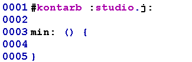
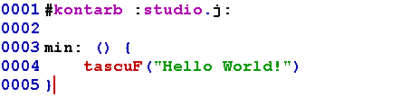

# How to create a Hello World program in BearE

## Let's load the required built-in libraries.

 This line loads the studio.j library. It allows your program to print text and read user input.  
 
 
---
 The main function is the entry point of every BearE program. The main function is currently empty. In the next step, we will write our first instruction inside it.
 
 
 
---

